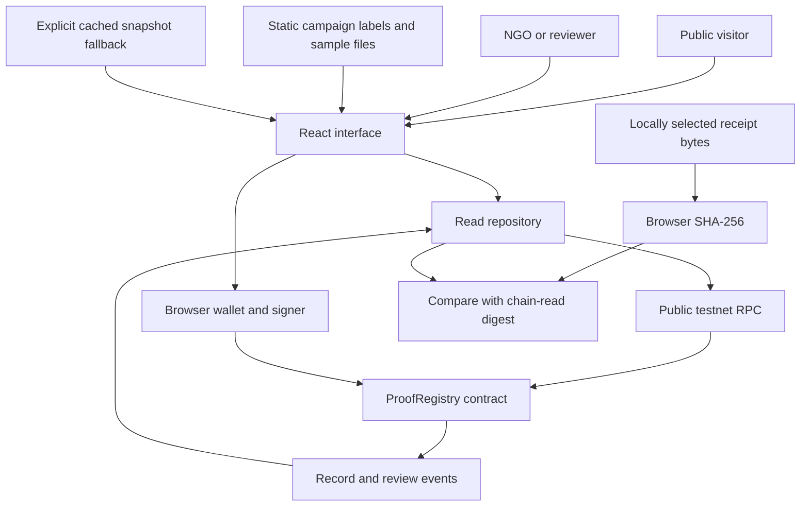

# TRACE Proof — Product Critique and 10-Hour Build Blueprint

Version: 1.0 · Prepared 16 September 2026 · Status: implementation specification, not implemented functionality.

**Build one small, complete public evidence trail: a recorded donation → allocations → expense claims → receipt integrity checks → separate auditor decisions.** The winning demonstration is that a judge can inspect a claim, change the receipt, see the mismatch, and independently inspect the corresponding blockchain record.

This blueprint consolidates and revises `IDEATION.md` and `IMPLEMENTATION_PLAN.md`. Those documents are source material, not organizer instructions. Their statements about event rules, required slides, and AI disclosure have not been verified against an official rulebook. This plan assumes one developer using substantial AI assistance, ten total hours including submission preparation, an EVM-compatible problem statement, and no required payment integration. Confirm the official rules and rubric at the start; adjust these assumptions if needed. No outcome or winning probability can be guaranteed.

## 1. Verdict: keep the idea, strengthen the implementation

The original idea is unusually careful about what blockchain proves. Keep that honesty. Keep the three-branch trace and the original-versus-modified receipt demonstration. Reduce the rest until the complete workflow is achievable by one person.

The novelty is currently moderate: donation transparency, document hashing, and auditor approvals are established patterns. Do not claim a first-of-its-kind invention. The opportunity is excellent execution: explain what is claimed, what is checked, what is disputed, and who is accountable in one view.

| Issue in the original plan | Why it weakens the submission | Revised decision |
|---|---|---|
| Real reads, live submission, and live review are partly optional | The UI could be mostly a simulation with one unrelated transaction | Make contract-backed reads and both core write paths the target MVP; describe any incomplete path explicitly |
| Only one genuine transaction is required | One transaction does not establish the entire advertised trail | Anchor the complete small demo dataset, including allocations, expenses, and reviews |
| ₹4,82,500 received and ₹3,61,000 utilized are illustrative | Judges cannot reconcile these totals with a single ₹10,000 trace | Use one ₹10,000 synthetic donation and derive every displayed total |
| “Utilized” sounds like verified expenditure | The contract only records the NGO's claim | Label it “Expense claims”; explain when using “claimed utilization” |
| “Independent auditor” is stronger than separate wallet addresses | Two addresses can belong to the same person | Say “separate authorized reviewer”; identify real-world independence as a pilot requirement |
| Role switcher resembles authentication | Selecting Auditor must not confer permission | Navigation chooses a workspace; the contract checks the actual wallet |
| Contract state and seed data can diverge | A UI may show an attestation that never happened | Chain state is authoritative; fixtures and cached snapshots are visibly labeled |
| Review changes are underspecified | A current status alone hides previous decisions | Store latest status plus append-only review events; expose the history |
| Expense metadata and file storage are underspecified | A fresh browser may lose submitted descriptions or receipts | Make proof-critical records recoverable from chain; clearly separate optional local labels and local files |
| Network work starts relatively late | Faucet/toolchain trouble can consume integration time | Check funds at minute zero and deploy the tested contract by hour three |
| Ten hours assumes team parallelism | A solo builder cannot follow the same throughput | Use the sequential schedule below and preserve two hours for QA and delivery |

**Best improvement per hour:** a small “Evidence summary” on every expense: claim recorded, file not checked/matched/mismatched, reviewer unreviewed/attested/flagged. Add a plain-language “Needs attention” list for flagged and unreviewed claims. These are derived views, not extra subsystems or opaque trust scores.

## 2. Product crux, positioning, and benefits

**Name:** TRACE Proof.

**Pitch:** “TRACE Proof makes donation-use claims inspectable: follow the allocation, check the receipt against its recorded fingerprint, and see who reviewed it.”

**Memorable promise:** “See the claim. Check the file. Know the reviewer.”

**Problem:** A payment acknowledgment says little about the claims made after a donation. Donors and reviewers need a way to connect declared spending to the evidence and decisions supporting it.

**Primary user:** a donor or public observer inspecting a campaign without signing in or connecting a wallet.

**Secondary users:** an NGO operator adding an expense claim, and a separately authorized reviewer attesting to or flagging it.

| User | Benefit demonstrated in the MVP | Future outcome to validate, not claim as achieved |
|---|---|---|
| Donor | Can inspect an allocation and check a supplied receipt | Better confidence and repeat giving |
| NGO | Can publish a consistent evidence trail | Less manual reporting effort |
| Reviewer | Can locate claims and preserve decisions with attribution | Faster review turnaround |
| Public observer | Can inspect flagged claims and transaction records | Stronger accountability |

The product is a **proof registry, not a payment processor or bank ledger**. Donation amounts are NGO-recorded declarations. No real donation is accepted in the MVP. All demonstration organizations, documents, and amounts are synthetic.

### The three properties to demonstrate

1. **Traceable:** one donation record connects to allocations and expense claims, with enforced amount limits.
2. **Tamper-evident:** a supplied file can be compared with the digest recorded for a claim.
3. **Accountable:** submissions and reviews expose their signing addresses and recorded history.

Blockchain makes this history publicly inspectable outside the frontend. A signed append-only database could satisfy some needs too; the particular benefit here is a shared public record whose inspection does not depend solely on the NGO's server. It cannot force the NGO to disclose all spending, establish legal identity, prevent collusion, or make false inputs true.

## 3. Scope and definition of done

### Target MVP — mandatory for a complete claim

- One campaign, one recorded donation, three allocations, three initial expenses.
- Public campaign overview and donation search; wallet-free read access.
- Trace page showing parent-child relationships, remaining balances, latest reviews, and history.
- Original/altered sample receipt downloads and local SHA-256 comparison against a chain-read digest.
- A deployed, tested proof registry on one public EVM testnet.
- A seed script that records the entire demonstration trail through actual transactions.
- NGO UI: select an existing allocation, enter an amount, select a file, submit an expense.
- Reviewer UI: select an expense, attest or flag, inspect the confirmed result.
- Refresh recovers new claims and reviews from chain events/state.
- Visible source/network/contract identity and useful error states.
- Build, core tests, README, three-minute demo, and the event's actual submission materials.

Donation and allocation creation are performed by the seed script in this MVP. Do not spend time building their admin forms. Both functions are still real contract operations and tested.

### Small enhancements, only after the target works

- “Needs attention” list derived from flagged and unreviewed claims.
- Copy IDs, hashes, and explorer links.
- Compact proof-summary JSON download, including IDs, amounts, digest, chain/contract, transaction references, and latest review. An export is a convenience, not an independently trusted authority.

### Explicit exclusions

No real payments, bank integration, AI fraud detector, chatbot, token, NFT, DAO, multi-chain flow, KYC, beneficiary identity collection, real NGO onboarding, accounting reconciliation, IPFS upload, backend database, mobile app, or drag-and-drop graph editor. No new features after hour eight.

### Reduced delivery if time runs short

Preserve the real, fully seeded chain trail, public reads, receipt verification, and existing review history. If a write UI is unfinished, remove its action controls and state “submission/review currently available through the seed script.” This is a reduced read-only prototype, **not completion of the target MVP**. Never label local simulation as a confirmed blockchain operation.

## 4. One canonical demo dataset

Campaign: **Maharashtra Flood Relief — Synthetic Demo**, ID `CAM-FLOOD-01`, illustrative target ₹25,000. This is not a claim about an actual relief operation.

Donation `DON-8F42A1`: ₹10,000, recorded by the NGO demo address. Label the source “Synthetic donation record”; do not invent a donor wallet or imply receipt of bank funds.

| Allocation ID | Category | Allocated | Initial expense ID | Expense claim | Initial review | Allocation remainder |
|---|---|---:|---|---:|---|---:|
| `AL-FOOD-01` | Food supplies | ₹6,000 | `EX-FOOD-01` | ₹4,800 | Attested | ₹1,200 |
| `AL-MED-01` | Medical supplies | ₹2,500 | `EX-MED-01` | ₹2,000 | Unreviewed | ₹500 |
| `AL-LOG-01` | Logistics | ₹1,500 | `EX-LOG-01` | ₹900 | Flagged | ₹600 |
| **Total** | | **₹10,000** | | **₹7,700** | | **₹2,300** |

Prepare fictional receipts for these records. The food receipt gets an original and visibly modified copy. Freeze the original bytes before seeding: even a harmless re-export changes the digest. Use static SVG receipts if convenient; they are easy to read and modify without a PDF toolchain. Treat user-selected files as bytes, not executable markup; do not inject their contents into the page.

The live submission can add **₹1,200** to `AL-FOOD-01` with a new unique expense ID and a separate sample receipt. After confirmation, expense claims become ₹8,900 and the allocation remainder becomes zero. The reviewer can then attest to that new claim. Rehearsals must not reuse IDs or exceed the original allocation: use a separate rehearsal deployment or demonstrate review changes on an existing expense. Never “reset” the public chain in the interface.

### Exact metric definitions

Let `D` be recorded donation value, `A` allocated value, `E` all expense claims, `T` expense value whose latest review is Attested, `F` latest Flagged value, and `U` Unreviewed value.

| Metric | Formula | Initial value |
|---|---|---:|
| Recorded donations | `D` | ₹10,000 |
| Allocated | `A` | ₹10,000 |
| Unallocated | `D - A` | ₹0 |
| Expense claims | `E` | ₹7,700 |
| Allocated, not yet claimed | `A - E` | ₹2,300 |
| Attested claims | `T` | ₹4,800 |
| Flagged claims | `F` | ₹900 |
| Awaiting review | `U` | ₹2,000 |
| Claimed utilization | `E / D × 100` | 77.0% |
| Reviewed value coverage | `(T + F) / E × 100` | 74.0% |
| Attested value coverage | `T / E × 100` | 62.3% |

Use zero-denominator “Not applicable,” not a misleading 100%. `T + F + U = E`. A flagged claim still consumes allocation capacity and remains in claimed expenditure; flagging does not refund money or erase the expense. A later review changes buckets, not the amount claimed. Never combine integrity status with financial metrics: a file check performed in one browser is not a global audit decision.

## 5. Screens and judge-facing experience

Use one small app with hash-based routes to avoid static-host deep-link configuration. Prefer four focused screens over an elaborate landing page.

### `#/` — Campaign

- Short pitch, synthetic-demo label, network/source badge.
- Four main values: recorded donations, expense claims, attested value, flagged value.
- A three-segment allocation strip and clear coverage definition.
- Prominent “Trace ₹10,000 demo donation” link and search box.
- Needs-attention rows link to the exact expense.

### `#/trace/DON-8F42A1` — Trace Explorer

- Donation header followed by three stacked allocation branches; ordinary CSS, no graph library.
- Each branch shows allocation, claims, and remaining capacity.
- Expand an expense to show amount, evidence digest, submitter, submission time, review, and transaction links.
- Separate labels: `Claim recorded`, `File not checked / Hash matched / Hash mismatch`, `Unreviewed / Attested / Flagged`.
- Receipt chooser and original/modified demo downloads next to the relevant expense.
- Timeline ordered by block number, transaction position, and log index. Timestamps are block times, not proof of real-world purchase dates.
- Unknown donation IDs produce “No record found”; RPC errors produce “Unable to check,” not the same empty state.

### `#/submit` — NGO workspace

- Show connected address, expected NGO address, current network.
- Allocation dropdown, remaining amount, amount input, file selection, generated expense ID, optional local description.
- After hashing, show a final summary and “Submit claim.” Wallet confirmation authorizes the transaction.
- Show awaiting-wallet, pending, confirmed, rejected, and failed states.
- On successful receipt, reload chain data and offer “Open new expense.”

### `#/review` — Reviewer workspace

- Pending/flagged claims list and exact selected claim details.
- Wallet must equal the authorized reviewer address; an NGO wallet cannot review.
- Attest or Flag, with a small reason-code selector such as `DOCUMENT_REVIEWED`, `INSUFFICIENT_EVIDENCE`, `AMOUNT_DISCREPANCY`, or `OTHER`.
- Preview the expense ID, amount, decision, and reason before the wallet prompt.
- Show previous decisions after a new review. Label “Latest reviewer decision,” not “certified authentic.”

**Visual direction:** light surfaces with navy text, blue primary actions, amber pending, green attestation, red mismatch/flag. Use text and icons as well as color. Make IDs copyable and hashes expandable. Favor a readable 1280×720 projector view; a normal stacked mobile layout is sufficient. Avoid gradients, animations, and charts that consume debugging time.

## 6. Architecture and module connections



No receipt bytes are sent to RPC. Only the digest and compact claim fields are submitted. The public read path does not depend on a connected wallet. A separate RPC provider handles reads; the injected wallet handles signatures.

### Stack and setup decisions

| Layer | Choice | Boundary |
|---|---|---|
| UI | React + TypeScript + Vite | One frontend package |
| Styling | Plain CSS with variables; Lucide if useful | Skip a styling framework setup unless already familiar |
| Blockchain client | ethers v6 | Use v6 consistently in frontend/scripts |
| Contract tooling | Hardhat 3 with its compatible ethers/TypeScript template | Do not mix Hardhat 2 tutorials/configuration into a v3 scaffold |
| Contract | Solidity; pin supported compiler after scaffold smoke test | One immutable prototype registry, no proxy |
| File hashing | Web Crypto `crypto.subtle.digest("SHA-256", bytes)` | HTTPS or localhost; small file cap, e.g. 5 MB |
| Network | Sepolia, subject to start-of-build availability and event requirements | One selected public network; local Hardhat for tests |
| Hosting | One static host the team already knows | `frontend/dist`; hash routing |
| Persistence | Contract state/events; static sample assets | No general document hosting or backend |

At Stage 0, select a Node release supported by both generated projects, install once, and commit exact dependency lockfiles and a runtime version file. Avoid spending the event upgrading tools. Vite's documented runtime requirements and Hardhat's current setup requirements should be checked together, not guessed from an old tutorial. See official references at the end.

### Repository layout

```text
/
├── TRACE_PROOF_BUILD_BLUEPRINT.md
├── IDEATION.md                         # original reference
├── IMPLEMENTATION_PLAN.md              # original reference
├── README.md
├── .gitignore
├── .nvmrc
├── docs/
│   ├── progress.md                     # real stage times, validation, limitations
│   ├── demo-script.md
│   └── submission-checklist.md
├── frontend/
│   ├── package.json / package-lock.json
│   ├── .env.example
│   ├── public/receipts/                 # synthetic original/altered sample assets
│   └── src/
│       ├── App.tsx
│       ├── styles.css
│       ├── pages/{Campaign,Trace,Submit,Review}.tsx
│       ├── components/{EvidenceSummary,AllocationTrail,HashVerifier,TxStatus}.tsx
│       ├── hooks/{useProofData,useWallet}.ts
│       ├── lib/{chainRepository,wallet,hashFile,money,ids,metrics}.ts
│       ├── data/{campaign,demoLabels}.ts
│       ├── generated/{ProofRegistry.abi.json,deployment.json}
│       └── types.ts
└── contracts/
    ├── package.json / package-lock.json
    ├── .env.example
    ├── hardhat.config.ts
    ├── contracts/ProofRegistry.sol
    ├── test/ProofRegistry.ts
    ├── scripts/{deploy,seed,exportFrontend,snapshot}.ts
    └── deployments/sepolia.json         # public addresses/receipts, no keys
```

Names describe intended responsibilities; use the exact script/config shape generated by the chosen Hardhat template. Two independent npm projects are sufficient. Do not introduce monorepo tooling.

### Module contracts

| Module | Input → output | Depends on |
|---|---|---|
| `ids.ts` | Canonical short ID → bytes32 | Same encoding shared with scripts |
| `money.ts` | Decimal INR string ↔ integer paise | No blockchain dependency |
| `hashFile.ts` | File bytes → `0x` + 64 hex digits | Web Crypto |
| `chainRepository.ts` | Deployment config → records, events, source block | ABI + public RPC |
| `metrics.ts` | Confirmed records/latest reviews → totals | Pure integer calculations |
| `wallet.ts` | Browser provider → account, chain, signer | ethers BrowserProvider |
| `useProofData` | Query/refresh → loading/data/error/source | Repository |
| `useWallet` | Connect/account/network events → permissions | Wallet adapter + contract roles |
| `HashVerifier` | Selected file + expected digest → local comparison | Hash utility; never alters review status |
| `Submit` / `Review` | Validated input → wallet transaction → refreshed data | Write contract + transaction state |

## 7. Data, provenance, and storage rules

### On-chain authoritative fields

- Campaign ID (one immutable campaign for this registry).
- NGO and reviewer addresses (nonzero, distinct, immutable for the prototype).
- Donation ID, amount, submitter, recorded timestamp.
- Allocation ID, donation ID, amount, category code.
- Expense ID, allocation ID, amount, receipt digest, submitter, timestamp.
- Latest review status, reviewer, timestamp, and reason code.
- Append-only events preserving every review decision.

No owner administration screen, role rotation, upgradeability, or multi-campaign contract is required. Prototype roles are chosen at deployment; replacing them requires a new deployment.

### Off-chain fields

Campaign title, narrative, target, category display names, fictional vendor labels, sample download paths, and optional descriptions are presentation metadata. They are not attested by the contract. Label optional descriptions accordingly. Do not promise cryptographic protection of a description when only the receipt digest is anchored.

New receipt bytes remain with the submitting user. A reviewer needs a separately supplied copy to perform the integrity check. The hosted synthetic demo receipts are available to everyone; arbitrary new uploads are not automatically published or retrievable from another device. This is an explicit MVP limitation, not a hidden storage feature. Future work: permissioned storage and a digest of canonical claim metadata.

### Encoding rules

- Short ASCII IDs use `encodeBytes32String`; reject more than 31 UTF-8 bytes. Trim and uppercase IDs consistently before encoding/searching. Decode IDs from events to recover new records without hardcoded lists.
- Category and reason use small enums with fixed labels.
- Receipt digests use SHA-256 over exact raw bytes; never ethers `id()` or keccak as a substitute for the file hash.
- Parse INR decimal text directly into paise using string operations. Reject negative values, exponent notation, zero, and more than two decimals. Never `Number(amount) * 100` for financial arithmetic.
- Use `bigint` in TypeScript and integers in Solidity. Serialize paise as decimal strings in JSON; do not `JSON.stringify` a raw bigint.
- Treat unknown category/reason codes as unknown, not as a fabricated label.

### Sources must be visible

| Source mode | UI label | Writes | Meaning of a digest match |
|---|---|---|---|
| Live chain | `Testnet · synced at block …` | Enabled for correct role/network | Matches the digest read from the specified chain/contract |
| Saved snapshot | `Cached snapshot · block … · not freshly checked` | Disabled | Matches the cached digest; live record was not rechecked |
| Development fixture | `Simulated data` | No real write claims | Matches a fixture; no blockchain claim |

An RPC error should show an error and an explicit cached-view option. Never silently replace live data with fixtures. All explorer links derive from validated network config and actual transaction receipts/logs. Do not invent transaction hashes.

## 8. Smart-contract specification

Use one `ProofRegistry` contract and no fund custody. Methods are nonpayable. Balances represent declared allocation capacity, not ETH held by the contract.

### Required interface

```solidity
constructor(bytes32 campaignId, address ngo, address auditor)
recordDonation(bytes32 donationId, uint256 amountPaise)
recordAllocation(bytes32 allocationId, bytes32 donationId,
                 uint256 amountPaise, Category category)
submitExpense(bytes32 expenseId, bytes32 allocationId,
              uint256 amountPaise, bytes32 receiptHash)
reviewExpense(bytes32 expenseId, ReviewStatus decision, ReasonCode reason)
```

Provide public role/campaign getters and record getters. Maintain donation allocated totals and allocation claimed totals in storage so checks are constant-time. Record existence explicitly or through an unambiguous nonzero field.

### Invariants

1. Only NGO can create donation, allocation, or expense records.
2. Only auditor can review; constructor rejects equal NGO/auditor addresses.
3. IDs must be nonzero and unique within their record type. No update/delete methods for claims.
4. Amounts must be positive; receipt digests must be nonzero.
5. Parent donation/allocation must exist.
6. Sum of allocations cannot exceed the parent donation.
7. Sum of expense claims cannot exceed the parent allocation.
8. Reviews require an existing expense and Attested or Flagged decision; no reset to Unreviewed.
9. Re-review is allowed, including correcting Flagged to Attested. Latest status updates while every previous review event survives. Reject an identical status/reason repeat to reduce accidental duplicates.
10. Flagging never releases allocation capacity. Corrections to claim amounts and reversals are outside scope.
11. Every successful mutation emits a reconstructable event. Failed transactions must not change counters.

Separate addresses enforce role separation, not real-world reviewer independence. A dishonest NGO could omit expenses or split fraudulent claims across IDs while remaining under allocation limits. Duplicate-document detection and vendor/payment verification remain outside scope; even matching bytes do not establish authenticity.

### Events and history

Emit DonationRecorded, AllocationRecorded, ExpenseSubmitted, and ExpenseReviewed with record IDs, parent IDs where applicable, amounts, sender, timestamps, and relevant category/digest/review fields. Use indexed parent IDs for filtered queries. Transaction hash, block number, and log index come from the log envelope, not contract storage.

Read logs starting at the recorded deployment block, in bounded chunks when an RPC limits ranges. Group child records by parent. Obtain current review from state or deterministic event replay; confirm each refresh against a single chosen block where practical. A small demo does not need a persistent indexing service. Cache block timestamps and avoid fetching the same block repeatedly.

Do not label broadcast transactions confirmed. Wait for a successful mined receipt, then reload. Handle account/network changes by clearing signer-dependent state. A mined receipt is adequate for this prototype; production would define a stronger finality policy.

### Core contract verification

Test the happy path end to end and failure boundaries: unauthorized caller for each write, duplicate IDs for each type, missing parents, empty IDs/digests, zero amounts, invalid constructor roles, exact allocation limit and one paise over, exact expense limit and one paise over, review of missing expense, invalid review state, repeated identical review, and re-review history. Assert relevant event payloads and unchanged totals after a revert. These tests protect actual trust guarantees, not cosmetic code structure.

## 9. Three complete runtime flows

### Public trace and receipt check

1. Open app → read deployment config → fetch records/events from deployment block.
2. Search canonical donation ID → load allocations → load expenses → attach latest reviews/history.
3. Compute totals from confirmed records; add static display labels.
4. User chooses receipt → enforce size cap → SHA-256 exact bytes → compare normalized hex digest.
5. Display matched/mismatched with the source mode and relevant contract/expense context.

For a live match: “This file matches the digest recorded for this claim. It does not prove that the receipt is truthful or that a payment occurred.” For a mismatch: “This is a different file from the one recorded; it may have been changed or selected incorrectly.” Do not automatically flag a claim because someone selected the wrong file.

### NGO submits an expense

1. Connect wallet → check chain ID and NGO address.
2. Select allocation → fetch remaining capacity → validate paise and file.
3. Generate a short unique expense ID → hash bytes → show final claim summary.
4. Request transaction → show hash immediately as pending → wait for receipt.
5. On success reload records/events and totals → open the new expense.
6. On rejection/failure retain form contents and allow retry. If status is uncertain, inspect the known transaction/expense ID before retrying. Prevent duplicate clicks while pending.

### Reviewer records a decision

1. Connect different authorized wallet → inspect the selected expense.
2. Optionally compare a supplied file; review decision remains a separate action.
3. Choose Attest/Flag and reason → verify summary → request transaction.
4. On success refresh latest state and append visible event history.
5. Both attesting and flagging count as reviewed; only attesting contributes to attested amount.

## 10. Ten-hour execution sequence and exact commit gates

This schedule totals **600 minutes** and includes a 30-minute contingency. It is deliberately sequential. Each row is a complete working increment. The end time is a target; **commit after the acceptance gate passes, not simply because the clock changed**. Do not create an empty commit to match this table.

| Stage / elapsed time | Build and deliver | Gate before commit | Suggested commit message |
|---|---|---|---|
| 0 · 00:00–00:25 (25m) | Check rules, runtime, wallet/RPC/faucet availability; scaffold both projects, ignores, env examples, lockfiles, README scope | Frontend boots; contract compiler runs; no secrets staged | `chore: scaffold TRACE Proof app and contract workspace` |
| 1 · 00:25–01:00 (35m) | Canonical IDs, integer-money utilities, synthetic receipts, dataset and metrics | ₹10,000 / ₹7,700 totals reconcile; original and altered digests differ; decimal boundary tests pass | `feat: define trace model and reproducible demo fixtures` |
| 2 · 01:00–02:20 (80m) | Registry roles, records, counters, events, tests | Core invariants and event/re-review tests pass locally | `feat: implement proof registry with tested allocation limits` |
| 3 · 02:20–03:00 (40m) | Deploy, seed full dataset, save receipts/address/deployment block, export ABI | Contract plus seed writes confirmed; getter totals match dataset; real explorer links work | `chore: deploy and seed testnet proof registry` |
| 4 · 03:00–04:10 (70m) | Read repository, source badge, public campaign and trace screens, search/timeline | Fresh browser without wallet reads the full real trail; unknown ID handled separately from RPC failure | `feat: render campaign and donation trails from chain records` |
| 5 · 04:10–04:45 (35m) | Receipt comparison panel, downloads, match/mismatch/error states | Original matches chain digest; altered file fails; no upload request occurs | `feat: verify receipt integrity locally against recorded digests` |
| 6 · 04:45–05:45 (60m) | Wallet/role handling, NGO submission form, receipt lifecycle | New claim confirms, persists after refresh, and updates remaining capacity; rejection recovers | `feat: submit expense proofs through authorized NGO wallet` |
| 7 · 05:45–06:30 (45m) | Reviewer screen, attest/flag/reason, review history | Different wallet reviews; wrong wallet rejected; current status and prior decision visible after refresh | `feat: add reviewer decisions with visible audit history` |
| 8 · 06:30–07:15 (45m) | Production build/host, failure states, projector/mobile/keyboard pass | Core flow passes hosted; wrong network/RPC failure/pending states are intelligible | `fix: harden hosted demo and transaction recovery states` |
| Buffer · 07:15–07:45 (30m) | Resolve the largest outstanding blocker; otherwise improve readability and needs-attention list | Main demo remains complete and tested | Commit only actual work, e.g. `fix: recover stale proof data after confirmed review` |
| 9 · 07:45–08:45 (60m) | Feature freeze by 08:00; README, architecture/demo instructions, required slides, AI disclosure, evidence screenshots | A reader can set up and inspect actual transactions; materials match implemented scope | `docs: document architecture validation and demo walkthrough` |
| 10 · 08:45–09:30 (45m) | Record demo, two rehearsals, clean-install/build check, final link checks | Three-minute recording plays; repo and live links accessible; limitation list accurate | `docs: finalize demo evidence and submission checklist` |
| Final reserve · 09:30–10:00 (30m) | Upload, verify submission, preserve local backup; critical fixes only | Required submission accepted/visible; note final commit SHA | Tag the tested commit `v0.1.0-demo` if useful; no forced commit |

### Time-based cut decisions

- **Minute 25:** if funds/RPC are unavailable, continue local contract work while resolving access; do not spend an hour repeatedly trying faucets.
- **Hour 3:** if public deployment is blocked, allow one focused 20-minute recovery attempt from contingency. A local-chain demo remains possible but does not satisfy the public-testnet target. Keep this limitation visible. Do not migrate tooling repeatedly.
- **Hour 4:10:** if public chain reads are not working, stop UI polish and fix the data path. This is more valuable than extra screens.
- **Hour 5:45:** if NGO submission is still blocked, preserve the real seeded trail and finish reviewer interaction before returning to the blocker. Report the missing path honestly.
- **Hour 6:30:** cut all enhancements. Finish one coherent demonstrable flow and failure handling.
- **Hour 8:** freeze features. Protect submission preparation and demo rehearsal.
- **Final 15 minutes:** only fix a broken submission link or essential demo failure.

No late addition of a second chain, payment flow, database, or storage service. If both write paths cannot be completed, submit the reduced scope with an explicit limitations section rather than misleading controls.

## 11. Commit history that demonstrates real progress

The history should explain how the project was built. A genuine series of working increments is stronger evidence than many tiny cosmetic commits. Ten or eleven meaningful commits is a guide, not a scoring formula; the actual judging rubric is unknown.

Current workspace inspection: the repository has **no commits yet**, and the two original Markdown files are untracked. This blueprint is planning work. If event rules restrict pre-event work, retain and disclose its actual preparation date; do not imply that it was created during the build window. Confirm whether these planning files may be included in the submission. Never delete or rewrite history to conceal preparation.

### At every stage boundary

1. Finish the narrow deliverable and run its acceptance check.
2. Review the diff; remove accidental files, generated caches, private keys, and local configuration.
3. Add a short entry to `docs/progress.md`: actual time, stage, what changed, what was tested, known limitations, and AI assistance used.
4. Stage the relevant files explicitly and review the staged diff.
5. Commit with the stage message; push to your configured remote if available and permitted.
6. Move to the next stage. A discovered defect gets a truthful follow-up `fix:` commit.

Example at the contract checkpoint (paths assume the layout above):

```bash
git status --short
git diff
git add contracts/contracts/ProofRegistry.sol contracts/test/ProofRegistry.ts docs/progress.md
git diff --cached --check
git diff --cached
git commit -m "feat: implement proof registry with tested allocation limits"
git push
```

Stage any additional changed config/lockfiles deliberately. Configure the remote/upstream once before relying on bare `git push`. Do not commit the entire working directory blindly. Do not use `--amend`, squash, force-push, or backdated dates to manufacture an event history. Keep actual bug-fix commits; they demonstrate iteration.

Optional commit body:

```text
Add NGO-only records and auditor-only review decisions.
Enforce donation/allocation capacity and preserve review events.

Validation: contract tests pass, including one-paise overflow and unauthorized review.
Known limitation: immutable demo roles; no role rotation.
```

Write the validation line only after actually running the checks. CI, if already familiar, is a useful stretch addition that runs the build and tests; do not spend scarce time building elaborate pipelines.

### Working with AI stage by stage

For each stage, give the assistant the stage number, previous validation result, and remaining time. The assistant should implement that stage, run its checks, report changed files and limitations, and provide the suggested commit message. You review the result and make the commit. Avoid one enormous “build everything” turn if it prevents you from understanding or checking intermediate changes.

Reusable instruction:

> Implement Stage N of TRACE_PROOF_BUILD_BLUEPRINT.md. Respect the locked scope and current project conventions. Run that stage's acceptance checks. Tell me what changed, what passed, what remains incomplete, and the exact files and message for my next commit. Do not make a Git commit on my behalf. Remaining time: X hours.

AI disclosure should reflect extensive assistance if that is what occurs. Suggested wording to adapt after building:

> AI assistance was used for product planning, substantial code generation, debugging, tests, and documentation. I reviewed and integrated the changes, ran the reported checks, and prepared the demonstration. The progress log records implementation milestones and limitations.

Do not claim that AI only supplied “selected suggestions” if it generated most of the project. Do not claim tests, personal review, or in-window work that did not occur. Follow the organizer's actual AI policy.

## 12. Quality gates and practical failure handling

### Required verification before freeze

- Contract invariants and event history tests pass.
- Money parsing handles `0.01`, `10.10`, excessive decimals, negatives, empty strings, and large values without floating-point loss.
- Metrics count a revised review once and keep flagged claims in allocation consumption.
- Browser hash matches the seed-script SHA-256 for the exact original bytes.
- Production build/typecheck succeeds.
- Manual end-to-end: read → compare → submit → refresh → review → refresh.
- Manual failures: no wallet, wrong account, wrong network, rejected prompt, RPC unavailable, unknown ID, altered file, and duplicate submission attempt.
- UI preserves confirmed state during pending transactions; it does not briefly display unconfirmed financial totals as final.
- A new browser can rediscover newly created on-chain expense IDs through events.

Use focused unit/contract tests and a short manual browser checklist. Full cross-browser automation, exhaustive UI snapshots, and a testing-framework migration are not requirements for this ten-hour build.

### Demo backups

| Failure | Response | Disclosure |
|---|---|---|
| Wallet unavailable | Show already confirmed claims/reviews and local file comparison | “This transaction was completed earlier.” |
| RPC unavailable | Explicit saved snapshot plus recording/explorer evidence | “This view is cached at block X.” |
| Public network never deployed | Local-chain workflow, tests, and limitations | “Public testnet deployment is incomplete.” |
| Static host unavailable | Serve production build locally | “Running the same build locally.” |
| New receipt unavailable to reviewer | Use supplied synthetic sample or ask operator for the original file | “File distribution is outside this MVP.” |
| Pending transaction is slow | Keep visible pending hash, continue with an existing proof | Never announce success before receipt confirmation |

Keep two testnet-only wallet accounts funded, a local production build, sample files, saved deployment metadata, screenshots, slides, and a screen recording. Do not put private keys or seed phrases in browser bundles or Git. `VITE_*` settings are public; RPC services used from a static client must support public client access and appropriate limits. Test contract reads from the actual hosted origin early enough to catch CORS or key restrictions.

## 13. Judging strategy and demo sequence

These are general judging dimensions, not an official rubric. Reweight after reading the event criteria.

| Dimension | What to show |
|---|---|
| Problem clarity | The gap between recording a donation and inspecting spending claims |
| Working implementation | Full seeded trail, real submission/review transactions, refreshed state |
| Technical depth | Amount invariants, role checks, append-only history, local byte hashing |
| Product clarity | One readable trace and separate evidence/reviewer states |
| Differentiation | Visible uncertainty and disputes, not an unexplained green trust badge |
| Feasibility | Small contract, no custody, explicit next step toward an NGO pilot |
| Development process | Meaningful commits, actual checks, progress log, honest AI disclosure |

### Three-minute demonstration

| Time | Action and message |
|---|---|
| 0:00–0:20 | “After a donation is recorded, how can someone inspect the claims made about its use?” State that the dataset is synthetic. |
| 0:20–0:50 | Open the ₹10,000 trace. Show the three allocations and ₹7,700 expense claims. Explain that these are declarations, not bank transfers. |
| 0:50–1:25 | Open food expense; compare original receipt, then altered receipt. State: “Matching bytes does not establish a truthful receipt.” |
| 1:25–1:50 | Show the ₹900 flagged logistics claim and the reviewer address. Explain that disputed claims stay visible. |
| 1:50–2:20 | Perform one rehearsed reviewer action, or show its previously confirmed transaction if slow. Do not wait through an uncertain wallet/network delay. |
| 2:20–2:40 | Open actual explorer evidence. Point out amount limits and separate authorized reviewer. |
| 2:40–3:00 | Show architecture briefly. Close: “See the claim. Check the file. Know the reviewer.” |

Both write paths should work in the product, but the presentation only needs one live wallet action. Keep the submit flow ready for questions. The best live demonstration is the one rehearsed on the actual machine, with no private-key handling on screen.

### Likely challenges and concise answers

- **Why blockchain?** It supplies a shared public history of commitments and signers, inspectable outside our frontend. It does not replace accounting controls.
- **Can the NGO lie?** Yes. The system preserves the claim and review, not truth at entry. Real deployment needs independent reviewers, identity checks, and reconciliation.
- **Can the NGO hide spending?** Yes. We show recorded claims, not completeness of an organization's finances.
- **Does a matching receipt mean genuine spending?** No. It means the bytes match the recorded digest.
- **Are these real donations?** No. These are synthetic donation records; payment acceptance is outside this prototype.
- **Does a different wallet guarantee independence?** No. It demonstrates role separation; actual independence requires organizational governance.
- **What happens to flagged money?** Nothing is moved or refunded. The claim stays counted and visibly disputed.
- **What if the website changes?** Proof-critical fields and review events remain inspectable through the specified contract. Static descriptions are not protected by this MVP.
- **What if a file disappears?** Its digest remains, but the digest cannot recover the file. Reliable, permissioned storage is future work.
- **Is this new?** The component technologies are established. Our focus is an understandable claim-level workflow with explicit evidence limitations.

## 14. Submission package and next steps after the event

Required outputs depend on the actual event. Prepare a concise README, working app URL if available, source repository, deployment/transaction links, test summary, short demo recording, screenshots, and accurate limitations/AI disclosure. If a slide template is required, use it. Otherwise six concise slides are enough: problem, trace screenshot, evidence/review model, architecture, implementation evidence, and limitations/next steps.

README must distinguish **implemented**, **demonstrated**, and **planned** functionality. Record exact setup commands after they have worked on this repository; do not copy untested commands from this planning document. Include the selected runtime, lockfiles, environment examples, deployment block/address/network, synthetic IDs, test commands, and known storage limitations.

### Final acceptance checklist

- [ ] Official rules, problem statement, AI policy, and required submissions checked.
- [ ] Complete synthetic chain trail exists; totals reconcile.
- [ ] Public trace works without a wallet.
- [ ] Original receipt matches; modified receipt mismatches.
- [ ] NGO submission works and survives refresh, or its absence is disclosed.
- [ ] Reviewer decision works and preserves history, or its absence is disclosed.
- [ ] Source labels distinguish live chain, cached snapshot, and fixtures.
- [ ] No unsupported authenticity, real-payment, or independence claims.
- [ ] Contract tests and production build pass; manual checks recorded honestly.
- [ ] No private keys/seed phrases/client-exposed secrets committed.
- [ ] README, demo, repository access, and submission links verified.
- [ ] Actual commit history preserved and final demonstrated SHA recorded.

After the hackathon, validate usefulness with one NGO and one reviewer before expanding the technology. Pilot measures: fraction of declared expenditure with available evidence, review turnaround, time to retrieve a claim's documents, and reviewer usability feedback. Payment reconciliation, secure file storage, metadata commitments, role rotation, and multiple independent reviewers come next. Do not promise improved donor retention until measured.

## 15. Official technical references

Checked while preparing this blueprint; recheck setup compatibility at implementation time. These sources support tooling choices, not event rules or predictions of success.

- [Vite getting started](https://vite.dev/guide/) — scaffolding and runtime requirements.
- [Hardhat 3 getting started](https://hardhat.org/docs/getting-started) — compatible project setup and tooling.
- [ethers v6 documentation](https://docs.ethers.org/v6/) — provider, signer, and contract interfaces.
- [Ethereum networks](https://ethereum.org/developers/docs/networks/) — Sepolia as the application-development testnet default.
- [MDN SubtleCrypto digest](https://developer.mozilla.org/en-US/docs/Web/API/SubtleCrypto/digest) — browser SHA-256 and secure-context requirements.

**First build action:** Stage 0. Confirm event constraints, check the local toolchain and two testnet accounts, and scaffold the two packages. The blueprint is ready to guide implementation; no application code or deployment is claimed to exist yet.
